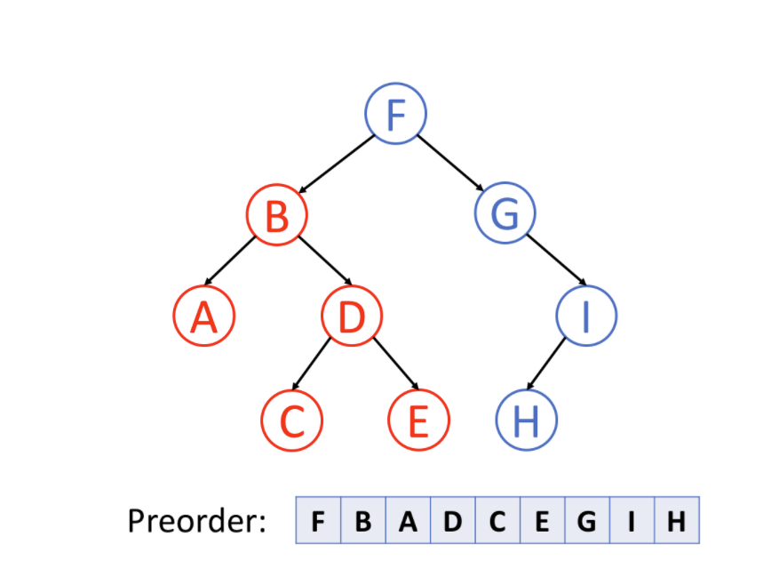
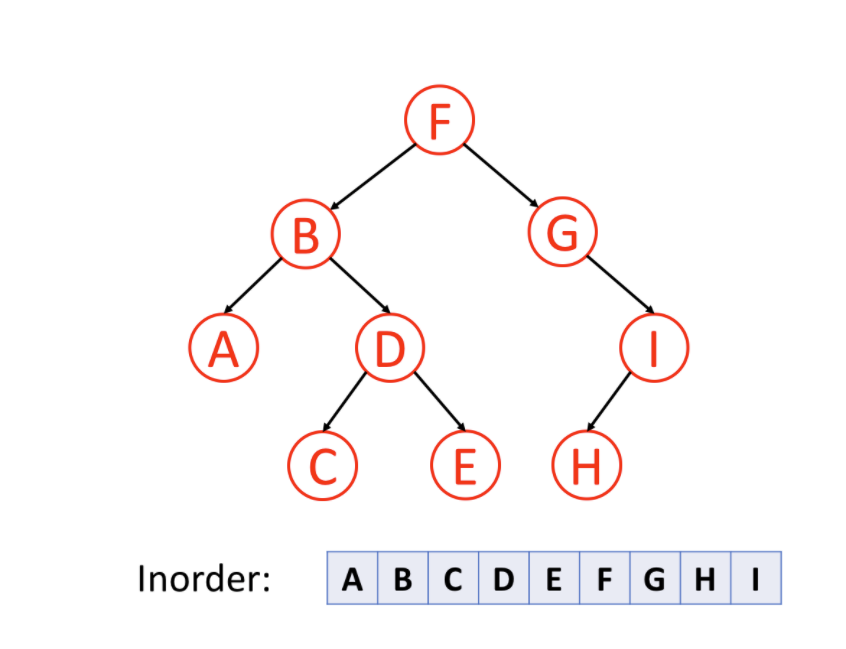
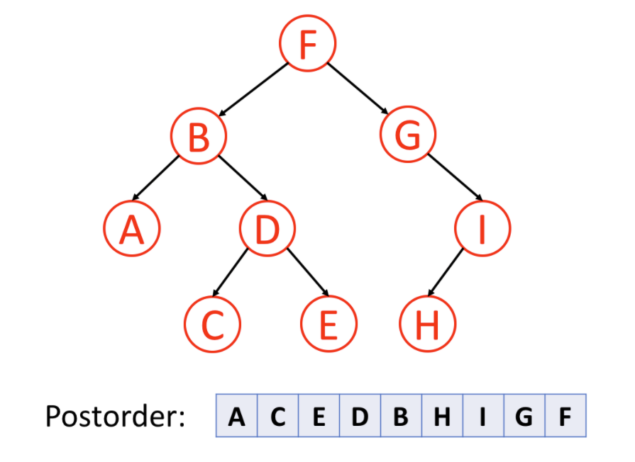
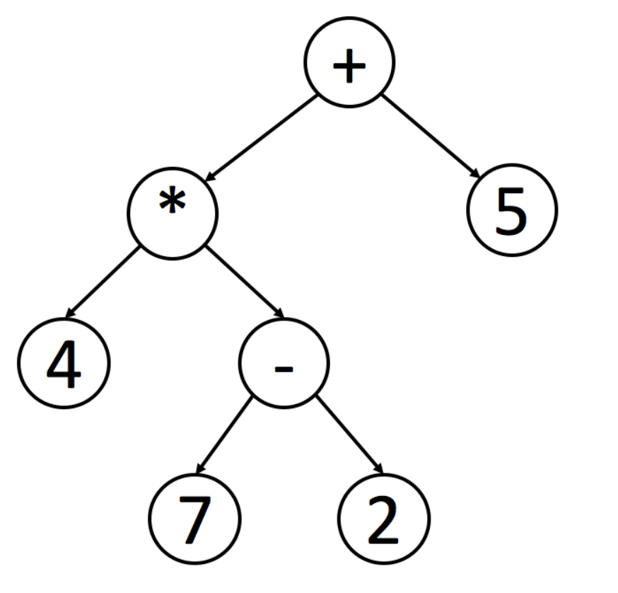

# 树的遍历

前序，中序，后序指的是根节点所在什么位置，第一个，中间，还是最后一个；

##  （一）定义

### 1、前序遍历

前序遍历首先访问根节点，然后遍历左子树，最后遍历右子树。

### 2、中序遍历

中序遍历是先遍历左子树，然后访问根节点，然后遍历右子树。

<!--  -->

通常来说，对于二叉搜索树，我们可以通过中序遍历得到一个递增的有序序列。 我们将在另一张卡片（数据结构介绍 – 二叉搜索树）中再次提及。

### 3、后序遍历

后序遍历是先遍历左子树，然后遍历右子树，最后访问树的根节点。

值得注意的是，当你删除树中的节点时，删除过程将按照后序遍历的顺序进行。 也就是说，当你删除一个节点时，你将首先删除它的左节点和它的右边的节点，然后再删除节点本身。

## （二）用途

### 1、前序遍历

+ 实现目录结构的显示

### 2、中序遍历

+ 对于二叉搜索树，中序遍历得到一个递增的有序序列。
+ 找出原始表达式：您可以使用中序遍历轻松找出原始表达式。 但是程序处理这个表达式时并不容易，因为你必须检查操作的优先级。
  + 编译器底层实现的时候用户可以实现基本的加减乘除，比如 a*b+c。

### 3、后序遍历

+ 你删除树中的节点时，删除过程将按照后序遍历的顺序进行。 也就是说，当你删除一个节点时，你将首先删除它的左节点和它的右边的节点，然后再删除节点本身。
+ 累加数——实现计算目录内的文件占用的数据大小

上述三种递归遍历方式时间复杂度和空间复杂度分析

> 时间复杂度0(n)
>
> 空间复杂度O(n) 

## 问题

什么是二叉搜索树

二叉查找树（Binary Search Tree），（又：二叉搜索树，二叉排序树）它或者是一棵空树，或者是具有下列性质的二叉树： 若它的左子树不空，则左子树上所有结点的值均小于它的根结点的值； 若它的右子树不空，则右子树上所有结点的值均大于它的根结点的值； 它的左、右子树也分别为二叉排序树。

参考链接：https://leetcode.cn/leetbook/read/data-structure-binary-tree/xe17x7/

